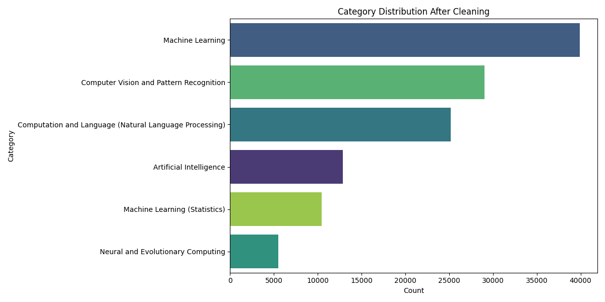

# NLP Classification (arXiv scientific dataset)

## Description
This project fine-tunes a BERT-based model for multi-class text classification in order to easily categorize a given scientific paper into the corresponding scientific area.

## Motivation
The goal was to demonstrate the effectiveness of transformer models for quick and accurate classification of text data, especially in scenarios with imbalanced class distributions.


## Dataset
**Kaggle obtained dataset.**
- **Source:** https://www.kaggle.com/datasets/sumitm004/arxiv-scientific-research-papers-dataset?resource=download
- **Shape:** (136238, 10)

As seen in the shape, the dataset possesses 10 features. These are
*['id', 'title', 'category', 'published_date', 'updated_date', 'authors', 'first_authors', 'summary', 'summary_word_count']*.

The main features of interest are 'category' and 'summary', while several of the other features were utilized for cleaning purposes.

## Methodology
This project implements a sequence classification model, utilizing a pre-trained model to assign a single scientific domain label to given text inputs.
I utilized the "distilbert-base-uncased" model from Hugging Face's Transformers library. 
The pre-trained model was adapted with a classification head and then further trained on the specific dataset of labeled research paper summaries.
Key training configurations included the default learning rate, a batch size of 12, and training for 1.5 epochs. 

### Cleaning
The dataset underwent a comprehensive cleaning process to ensure data quality and relevance. Key steps included:
* **Text Normalization:** Standardizing text columns to remove inconsistencies.
* **Duplicate Handling:** Identifying and removing duplicate entries, particularly complex cases involving variations in titles and author names. A strategy leveraging title-author combinations and summary content was implemented, which included normalizing author strings to lower-case initials in order to accurately detect resubmissions or common author variations.
* **Irrelevant Data Filtering:** Removing rows where summaries fell outside a desired length range to ensure content quality.


### Handling Class imbalance
Due to the dataset initially having an extremely large amount of categories, many of which had only 1-10 papers, the categories were filtered, with only those
having more than a given number of points being maintained. This leads to the final number of categories being 6.

This can be seen in the final category distribution plot.




The dataset is inherently largely unbalanced, something that was dealt with by initially considering undersampling, followed
by calculating the weights for each class, and prioritizing macro-f1 as an evaluation metric.


### Setup and Running the code
- Clone the repository:
   ```bash
   git clone https://github.com/yourusername/project-name.git
   cd project-name
- Create a virtual environment ``(.\venv\Scripts\activate on Windows)``
- Install dependencies ``pip install -r requirements.txt``
- Run the script ``python main.py``

### Results
- **Overall Accuracy:** 0.787
- **Macro F1-Score:** 0.752  (Chosen as primary metric due to class imbalance)
- **Macro Precision:** 0.737
- **Macro Recall:** 0.779
- **Validation Loss:** 0.641

The confusion matrix summarizing the end results is depicted bellow:


Something making the overall process relatively difficult is the fact the top 6 categories in number of values - which are the ones considered - all belong in neighboring fields. 
Despite this, the predictions for several of the classes are satisfactory.

"The Neural and Evolutionary Computing class" has somewhat lower metrics which is somewhat expected due to the significantly lower amount of data points it possesses.

On the other hand the other low metric classes ('Machine Learning' and 'Machine Learning (Statistics)') are two extremely close areas of study, so it is only natural for the summaries to be similar and hence confuse the model.

The individual class f1 scores can be seen bellow.

- **Class 0:** 0.752
- **Class 1:** 0.715
- **Class 2:** 0.925
- **Class 3:** 0.715
- **Class 4:** 0.914
- **Class 5:** 0.535

where {0: 'Artificial Intelligence', 1: 'Machine Learning', 2: 'Computation and Language (Natural Language Processing)', 3: 'Neural and Evolutionary Computing', 4: 'Computer Vision and Pattern Recognition', 5: 'Machine Learning (Statistics)'}.
